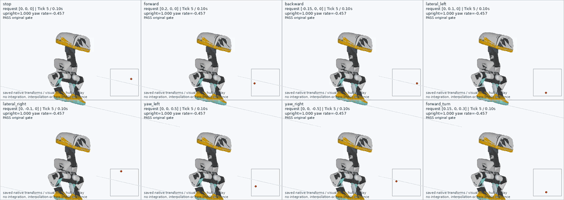
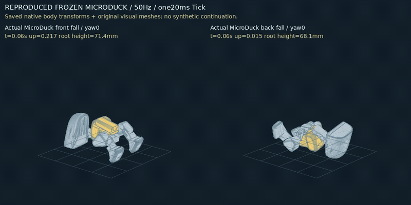
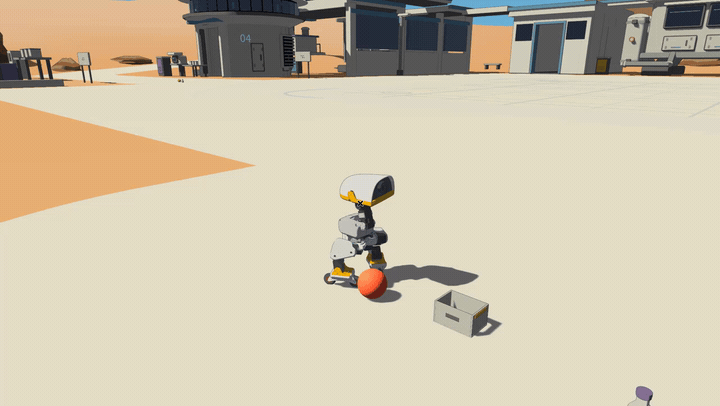
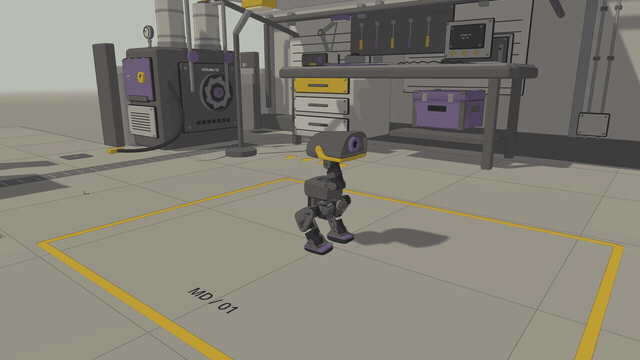
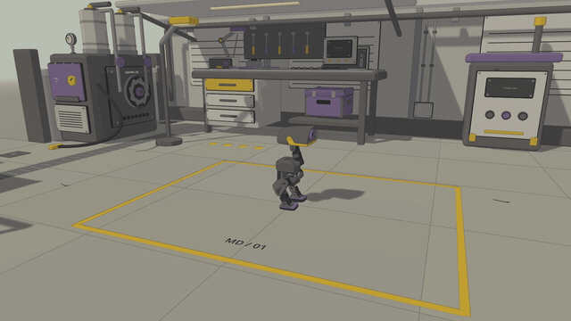
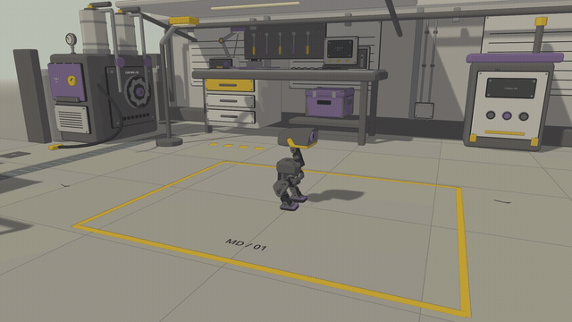
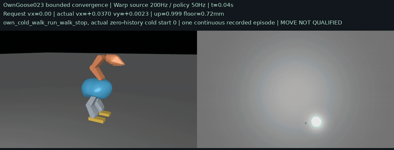
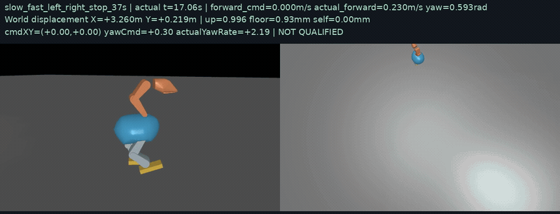

# Bevy_Sim2Sim

**MicroDuck、Goose 与 Unitree G1 是并行推进的 Sim2Sim 课题。** 项目以 Rust＋Bevy＋Rapier 接入真实物理、ONNX策略及本地模型，保留各课题的成果与历史实录。默认游戏物理为 **50Hz，每Tick一次真实积分**；源端高频候选和开发诊断单独标注。

[MicroDuck](#microduck) · [Goose](#goose) · [Unitree G1](#unitree-g1) · [成果录像来源](docs/sim2sim_results_gallery.md) · [开发交接](docs/handoff.md) · [工程规范](bevy_engineering_rules.md) · [CPU CI](https://github.com/sgyli7/Sai_Lab/actions/workflows/bevy_sim2sim_cpu.yml)

| 课题 | 已记录的阶段成果 | 当前范围 |
| --- | --- | --- |
| MicroDuck | 三轴移动、倒地起身、轮滑；历史坐站／踢球／翻滚 | 保留Godot与Bevy各版本；九技能整体仍待正式验收 |
| Goose | 自身策略慢走约0.413m/s、快跑约0.729m/s及快慢切换停止；历史低速双向转向 | 023为MuJoCo200Hz源端速度基线；新高速全向与Bevy50待验收 |
| Unitree G1 | 科学站抓取、持箱行走、容器放置与中文操作回归 | 冻结T1为3/10、T2为2/10；完整任务仍待验收 |

## MicroDuck

### 三轴移动：前后、左右侧移、双向转向与行进转弯



candidate008／native012 的 **50Hz Rapier＋CPU ONNX** 实际记录，八个独立案例并排原速展示；原固定测试8/8，随机测试59/64。画面重现保存的原生刚体位姿，不是一个串接全部动作的单世界回合，也不是新Bevy窗口录像。完整九技能资格仍未通过。

### 从前倒、后倒起身



冻结Stand策略／native010 Rapier＋BAM的两个真实恢复案例，完整10秒原速展示；原四姿态固定12/12复现通过。任意随机扰动、轮式恢复及跨机器人起身资格仍需各自验证。

### Bevy轮滑阶段实录



早期Bevy game009的19秒连续窗口录像，物理／策略50Hz，展示轮滑推进、刹车、转向与蹲姿。保留该版本实际成果，不继承后来game015的验收数字。

### 历史Godot成果保留

| 坐下与站起 · 13秒 | 右脚踢球 · 6秒 | 翻滚回正 · 6秒 |
| --- | --- | --- |
|  |  |  |

均来自旧Godot dt=20ms版本的完整原速原片，局部单次演示判分通过；保留历史成果，不作为当前Bevy迁移或九技能整体资格。每段来源、版本和哈希见[录像清单](docs/sim2sim_results_gallery.md)。

## Goose

### 新速度基线：站立→慢走→快跑→慢走→停止



自身 **65→18 Actor** 的真实冷启动连续33秒：该次慢走约 **0.413m/s**，快跑约 **0.729m/s**，全程无重置、回滚、Teacher或换Actor。这是 **MuJoCo200Hz物理／50Hz策略与数字驱动** 的源端成绩；Bevy／Rapier50Hz接收尚未通过。

[完整MP4原片](assets/game/arts/game_play/videos/goose_move023_continuous.mp4) · [冻结速度基线与模型身份](docs/goose_move_baseline.md) · [Move实现分支](https://github.com/sgyli7/Sai_Lab/tree/codex/goose_move/Bevy_Sim2Sim)

### 历史低速双向转向与停止



保留原37秒连续录像中的17–37秒，旧显式170时钟候选完成左转→右转→停止。该片属于历史低速策略，不能与023速度录像合并为一个已合格的高速全向Actor。当前训练按 **移动中左右转→原地左右转→移动中平移→纯平移** 扩展，同时保留快慢速和停止回归。

## Unitree G1


2026-10-05实际中文窗口回归：停止并重置旧回合后，新回合完成2527Tick、四次N1.6、三次本回合Qwen，箱子移动 **1.99米**，放稳并松手 **2.76秒**。GIF为行走与释放两段原速节选，完整原片与审计保留。冻结成绩 **T1 3/10、T2 2/10**，各8/10与全程连续运行仍待验收。[中文操作入口](https://github.com/sgyli7/Sai_Lab/blob/main/Bevy_Sim2Sim/docs/g1_station_session.md) · [G1阶段记录](https://github.com/sgyli7/Sai_Lab/blob/main/Bevy_Sim2Sim/docs/g1_milestone.md)

<details>
<summary>G1完整阶段成果：视觉松手、持箱行走、真实取放、源任务搬箱与抓箱</summary>

## G1 新进展：科学站视觉搬运并松手


**2026-10-05 实际中文窗口回归。** 在旧本地 Qwen 请求尚未返回时零 Tick 停止并重置；新回合完成 2527 Tick、四次 N1.6、三次本回合 Qwen，箱子移动 **1.99 米**、放稳并松手 **2.76 秒**。完整原片与独立审计保留，截图和模型数组不含验收真值。新 GIF 为 74–79 秒行走与 97–104 秒释放的原速节选；当前固定任务输入、停止、重置、全景和抓取细节见 [操作说明](https://github.com/sgyli7/Sai_Lab/blob/main/Bevy_Sim2Sim/docs/g1_station_session.md)。冻结成绩仍为 **T1 3/10、T2 2/10，均未达标**。

以下为保留的先前阶段录像与验证。


**2026-10-04 实际 Bevy 窗口录像，5 秒持箱行走＋7 秒容器释放，两段均为原速。** 原失败位置在双手拇指准备修复后，通过了中文指令 → 初始本地 Qwen 准入 → 四次原配 N1.6 新图推理 → 新 RGB／Qwen 目标选择 → 传统几何搬运 → 新图松手准入 → 最终图像反馈。箱子水平移动 **1.99 米**，机器人移动 **1.35 米**；独立检查确认箱体完全进入目标区、由容器支撑、与所有机器人链接分离并稳定 **2.76 秒**。全轮 2,527 次真实 50 Hz 身体／电机更新，抓取后至松手前 2,102 Tick 均为当前手接触支撑；机器人全程站立。完整原片 **104.16 秒**。

原成功位置的新回归也通过 2.6 秒放置，全部 2,507 个物理步骤与旧成功轮相同。两例共执行 **5,034 次积分、8 次原配 N1.6、6 次本地 Qwen 请求**，没有物体附着或验收真值输入，详见 [双手准备修复与回归](https://github.com/sgyli7/Sai_Lab/blob/main/Bevy_Sim2Sim/docs/g1_milestone.md#双手拇指准备修复与两例原生回归)。原先距离修复的成功录像、失败轨迹和本轮模型加载中断均保留。

**2026-10-05 使用冻结五组位置 × 两个种子的完整新十轮为 2/10，未达到 8/10；T1 为 3/10。** 全部失败与原速录像均保留，成功样例不替代失败回合。4 PGS／16 PGS 开发配置及模型／图像边界暂停仍存在，任意目标和连续全程 1× 尚未取得资格。新结果见 [冻结十例与操作入口](https://github.com/sgyli7/Sai_Lab/blob/main/Bevy_Sim2Sim/docs/g1_milestone.md#2026-10-05-冻结十例与操作入口)，旧 1/10 作为 [历史十轮记录](https://github.com/sgyli7/Sai_Lab/blob/main/Bevy_Sim2Sim/docs/g1_milestone.md#科学站-t2-五位置两种子110未达标) 保留。

## G1 阶段成果：科学站持箱行走


**2026-10-04 实际 Bevy 窗口录像，12 秒连续原速节选。** 四次原配 N1.6 新图像推理完成抓箱后，G1 持物等待 2 秒，在科学站公开空旷通道转向、行走，随后执行两秒零导航停止阶段。完整运行中箱子水平移动 **2.29 米**，机器人从持物等待结束处移动 **1.71 米**；抓取后的 **1,154 个步骤**全部有当前手接触支撑，机器人保持站立，没有物体附着约束。

本轮执行 1,354 次真实 50 Hz 积分和身体控制更新，明确采用 4 PGS 开发诊断配置。行走目标来自公开通道指令，控制使用传统几何和自身状态；本轮没有调用 Qwen，也没有放入目标容器或松手。模型／图像边界仍有显式暂停，**正式 T2 成功率和全程连续运行尚待验收**。原有取放与源任务搬箱录像继续保留。

容器放置的早期诊断曾因相机遮挡、左拇指净空不足而拒绝松手；失败图像、轨迹和机械正例均保留。上方新一轮在修正凸包净空估算、有限拇指准备和新图像交接后通过了单次独立放置检查，详见 [阶段运行记录](https://github.com/sgyli7/Sai_Lab/blob/main/Bevy_Sim2Sim/docs/g1_milestone.md#科学站视觉搬运与容器释放单次通过)。

## G1 阶段成果：科学站真实取放


**2026-10-04 实际 Bevy 窗口录像，12 秒连续原速节选。** G1、苹果、盘子和科学站碰撞体处于同一个 Rapier 世界；本轮完成 1,046 次真实 50 Hz 积分，独立检查确认物体放稳、与手分离并由盘子支撑 **6.02 秒**。流程包含一次原配 N1.7 新图像推理、可见标记定位及传统几何抓取／放置，使用明确开启的预测关节限制与 16 PGS 诊断配置；本片没有调用 Qwen，尚未取得正式 T1 资格。

### G1 搬箱、行走和释放：源任务近似场景


同日实际窗口录像的另一段 12 秒原速节选。完整运行中箱子水平移动 **1.99 米**、机器人水平移动 **1.32 米**，独立检查确认最终放稳并松手 **2.52 秒**。本轮使用四次原配 N1.6 新图像推理和传统搬运／定位／释放控制，明确开启 4 PGS 诊断配置；本片的复跑没有调用 Qwen。更早独立运行已通过真实新 RGB → 本地 Qwen 选择搬运 → 原生执行 → 新图像反馈。两轮完整物理轨迹一致。

这是源任务近似场景；科学站持箱行走和单次视觉容器放置见上方新录像，**正式 T2 成功率仍未通过**。初始抓取和搜索尚未由 Qwen 调度，模型／图像边界有显式暂停，不计为连续全程 1× 验收。

<details>
<summary>新进展：科学站中的原配视觉抓箱</summary>


科学站已接入原任务货架、台车、箱子和目标容器。四次实际本体相机图片 → 原配 N1.6 推理 → 200 次真实 50 Hz 积分后，箱子被双手接触抓离货架、抬高 **14.4 厘米**，机器人保持站立。货架与台车的六个原始碰撞体和六个对应可见网格，与 2,553 个科学站碰撞体共用一个世界；原始宽平面已移除。

这段额外 GIF 是原录像首次绘制完成后的 **7.04 秒**有效画面，没有补帧延长；原有 12 秒 GIF 继续保留。本轮明确使用 4 PGS 诊断配置，图像／推理边界有暂停，没有调用 Qwen。本片只记录最初抓取阶段；上方新轮已验证单次持物行走与视觉容器放置，**正式 T2 成功率仍待验证。**

</details>

录像只裁切时间和显示区域、降低 GIF 导出尺寸／采样率，没有加速、补造动作或替换物理轨迹。原始窗口均为 1920×1080、8×MSAA。完整录像、物理日志和模型身份保存在外部证据目录；准备与运行入口见 [G1 阶段运行与录像](https://github.com/sgyli7/Sai_Lab/blob/main/Bevy_Sim2Sim/docs/g1_milestone.md)，外部权重和本体许可见 [制品清单](https://github.com/sgyli7/Sai_Lab/blob/main/Bevy_Sim2Sim/docs/g1_artifact_inventory.md)。

主页片段均来自 URI 展示渲染的实际窗口重录。G1 外壳为官方银灰色，头部、关节、手和脚使用深色；蓝色环境反光与暖白建筑表面分开。展示层修复了毫米级网格的无效法线和黑色破面，保留原网格形状。VLA 仍使用原本体／辅助相机，新科学站持箱行走重录的七张传感器图、52 个模型输入／动作数组和 1,354 个物理步骤与原渲染一致；原有取放、源场景搬箱的对照见运行说明。实现、逐像素核对的边界和关闭方式见 [G1 展示渲染](https://github.com/sgyli7/Sai_Lab/blob/main/Bevy_Sim2Sim/docs/g1_uri_presentation.md)。


</details>

## 当前功能与验收

| 模块 | 已实现 | 当前边界 |
| --- | --- | --- |
| 固定步运行时 | 唯一 Rapier 世界、默认 50 Hz 时钟、事件队列、逐 Tick 推理／积分／发布、失败停机 | 完整 BAM 与合格机器人控制器尚未接入正式游戏循环 |
| 科学站 | v18AJ／`windpass_compound_v7` 场景、固定机位与跟随相机、描边与静态标牌烘焙 | 20 个可移动道具碰撞体尚未导入，完整机器人通行与接触待验收 |
| 机器人显示 | 同源编译模型与外观、原生位姿帧、腿式与轮式初始化 GPU 预览 | 初始化几何与显示通过不等于动态控制通过 |
| 实时诊断 | 独立 60 Hz 物理／CPU ONNX 工作线程、顺序发布、最终窗口截图、逐帧收据 | P-only 诊断控制器；旧 ONNX 重放未取得技能资格 |
| 性能工具 | Bevy 时间线、Rapier 阶段计时、线程 CPU 时钟、GPU 时间戳与额外主线程负载探针 | 非默认开发功能；业务负载需按实际内容复测 |
| 源端训练 | 60/60 MuJoCo Warp＋BAM 探索训练与独立评估流程 | 最终策略未通过多种子 Idle，未晋升生产 candidate |

固定步运行时强制每个到期 Tick 执行“事件／场景同步 → 一次推理 → 力矩 → 一次积分 → 时钟提交 → 状态发布”，不隐藏高频时间子步。显示可以跳过中间姿态，工作线程仍连续执行每个物理和策略 Tick。接口与验收边界见 [固定步与实时接线](docs/fixed_step_runtime_probe.md)。

当前科学站已有六个真实 GPU 机位复核。同世界腿式初始化包含 2,553 个站体静态碰撞体，共 16 个 body／2,564 个 collider／14 个 joint；地形保留的两个零面积源三角及道具未导入项仍需后续处理，详见 [科学站说明](docs/station_layout_redesign.md)。

## 性能进展

以下为 **2026-09-30 开发窗口测量**：NVIDIA GB10、Linux / Vulkan、解锁 X11 桌面、1920×1080、8×MSAA、原阴影配置、真实 CPU ONNX，每轮 600 个物理 Tick。无额外负载的吞吐使用不含新增 CPU／GPU 探针、Chrome 时间线和 Rapier 计时的构建；分段成本与额外负载另用测量构建采集。

| 项目 | 实测结果 |
| --- | --- |
| 默认 FIFO 主循环吞吐 | 两轮约 60.07 FPS |
| 不锁帧主循环吞吐 | 三轮约 150–157 FPS |
| 不锁帧，额外 10 ms 主线程 CPU 负载 | 两轮约 75 FPS |
| 主线程 CPU | P50 约 1.43 ms，P95 约 2.66 ms |
| 根渲染图 GPU | P50 约 4.56 ms，P95 约 5.32 ms |
| FIFO 下新增主线程纯计算预算 | 建议先按 10 ms 规划；受控容量约 12 ms，14 ms 时吞吐开始下降 |

上述历史测量的物理与推理均保持 60 Hz，工作线程未观察到误期。FPS 表示活跃主循环吞吐，不等于显示器或远程视频的显示频率。不锁帧使用 `AutoNoVsync` 请求，驱动最终呈现模式未单独采集。

10–12 ms 额外负载下平均吞吐仍约 60 FPS，但帧间隔 P95 增至约 23 ms；因此 10 ms 是当前场景的规划起点，不能保证每帧准时。真实业务的内存访问、锁、同步推理或共享 GPU 推理需另行测量。代码对照保持逐 Tick 状态和最终 RGBA 画面一致，保留原画质；这些开发结果尚未授予正式游戏性能或技能资格。

测量开关、计时边界与复现方法见 [实时窗口性能诊断](docs/render_performance_triage.md)。原始 trace、火焰图、收据、日志与二进制随所属实验归档，不入库。

## 快速开始

在本目录运行。需要 **Rust 1.98**、可用的图形桌面与 Vulkan 驱动；当前 Bevy 配置启用 Linux X11。Linux 构建库清单见 [CPU CI 配置](../.github/workflows/bevy_sim2sim_cpu.yml)。科学站预览使用仓库内的场景、shader 和字体。

```bash
# 科学站窗口；目前正式入口仅开放 robot none
cargo run --locked --release -- --scene science_station_preview --robot none

# 基础无头验证：600 次积分、20 次冷重置
cargo run --locked --features dev_tools -- \
  --headless --verify --scene foundation --robot none --output .scratch/foundation

# CPU workspace 测试；需要外部原生 fixture 的用例默认忽略
cargo test --locked --workspace
```

基础验证明确记录 `inference_count=0`，只验证工程基础。尚未实现或验收的机器人模式返回非零退出码。

Tab 切换机位；跟随视角用鼠标右键环视、滚轮调整距离。截图和限帧属于非默认开发功能：

```bash
cargo run --locked --release --features dev_tools -- \
  --scene science_station_preview --robot none --view overview \
  --frames 120 --capture /tmp/bevy_station_overview.png
```

`BEVY_SIM2SIM_ASSETS` 可指定资产根。必需字体／shader 缺失、资产加载或 GPU 管线失败会返回错误。

### G1 开发入口

G1 的成功样例属于显式开发诊断，需要外部 SHA256 绑定的本体、控制器、任务权重、几何和校准文件。使用 [中文操作入口](https://github.com/sgyli7/Sai_Lab/blob/main/Bevy_Sim2Sim/docs/g1_station_session.md) 构建和启动固定苹果或箱子实验；支持输入、启动、停止、重置、全景和抓取细节。任意任务及未经验证的导航能力仍未开放。普通科学站预览不会自动加载模型或运行机器人任务。

### 真实机器人开发入口

```bash
cargo build --locked --release -p dev_tools_minigame --features rendering_preview \
  --bin robot_initialization_preview \
  --bin station_robot_60hz_diagnostic \
  --bin station_robot_live_preview \
  --bin robot_pose_sequence_video
```

这些入口需要另行准备 SHA256 绑定的编译本体、外观、源 qpos、ONNX 策略及原生 ONNX Runtime；克隆仓库不会自动取得全部诊断输入。初始化工具只读取唯一世界的零积分快照；实时窗口和录像工具复用真实诊断状态，不创建第二套物理或 FK。参数见 [渲染与捕获接线](crates/modules/rendering/README.md)、[ONNX 诊断](docs/legacy_nine_onnx_aj_fixed_step_video.md)及 [性能诊断](docs/render_performance_triage.md)。

旧九模型录像目前用于失败定位：`alpha_stand` 起步摆动、约两秒倒地，多个其他策略也失稳。源端训练与评估方法见 [PPO 探索流程](docs/source_rl_exploratory_smoke.md)和 [多种子 Idle 评估](docs/source_rl_multirun_60hz.md)。

## 工程与依赖

工程按公共层 → 业务层 → 开发层组织：`common_minigame` 提供业务无关基础，`robot_minigame` 管理本体与位姿合同，`simulation_minigame` 持有唯一物理世界，`rendering_minigame` 提供运行时显示，`dev_tools_minigame` 管理诊断窗口、截图、训练与测量。根包负责启动装配；发布构建默认不含开发工具，正式资源包须排除开发场景。最终游戏不依赖 Python。

依赖由 [Cargo.lock](Cargo.lock) 固定，Cargo 自动获取 Rust 包。采用直接 Rapier 桥接，兼容性边界见实施计划。

| 依赖 | 固定版本 | 来源 |
| --- | --- | --- |
| Bevy | 0.19.1 | [官方 crate](https://crates.io/api/v1/crates/bevy/0.19.1/download) |
| Rapier 核心 | 0.35.3 | [官方 crate](https://crates.io/api/v1/crates/rapier3d/0.35.3/download) |
| ORT Rust | 2.0.0-rc.13 | [官方 crate](https://crates.io/api/v1/crates/ort/2.0.0-rc.13/download) |
| ONNX Runtime CPU | 1.30.0 Linux aarch64 | [官方原生运行库](https://github.com/microsoft/onnxruntime/releases/download/v1.30.0/onnxruntime-linux-aarch64-1.30.0.tgz) |

原生运行库归档 SHA256 为 `e16a27a8ed330bbc698df7330b0cf56e722f354e3bcc92118682c74ef3c3e3da`；解压后的 `libonnxruntime.so.1.30.0` SHA256 为 `64e903a43a041240fd6bcffe0ac6d4fea47ef87bf24b9d097801bd00a9612a4b`。

本地 `third_party/rapier3d` 基于官方 0.35.3 发布源码，含默认关闭的 Sim2Sim 观测／诊断功能及固定场景 CCD 缓存维护。具体补丁与上游身份见 [本地变更](third_party/rapier3d/LOCAL_CHANGES.md)和 [原始来源](third_party/rapier3d/UPSTREAM_SOURCE.json)；当前观测仍未提供完整 BAM 控制外载。

## 来源与许可

自研 Rust 包声明 Apache-2.0。第三方源码、字体与模型分别遵循原许可：Rapier 保留 [许可证](third_party/rapier3d/LICENSE)，Noto 字体保留 [许可声明](assets/third_party/fonts/license.debian)。MicroDuck 上游对 3D 模型另有 Creative Commons BY-SA-NC 声明，模型及衍生网格须保留来源和非商业限制，不能归入自研代码许可证。

开发输入、模型、权重、录像和实验结果保留在所属仓库的历史备份目录 `/home/ethan/ProjectBackups/<date>/Sai_Lab/`；一次性进程文件使用 `/tmp`。更早的 Godot 调研保留在 [历史研究](docs/research.md)，当前实现以 Bevy 实施计划和运行说明为准。
