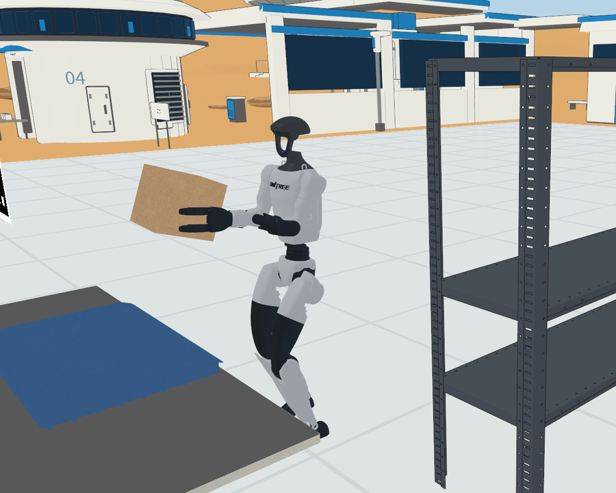
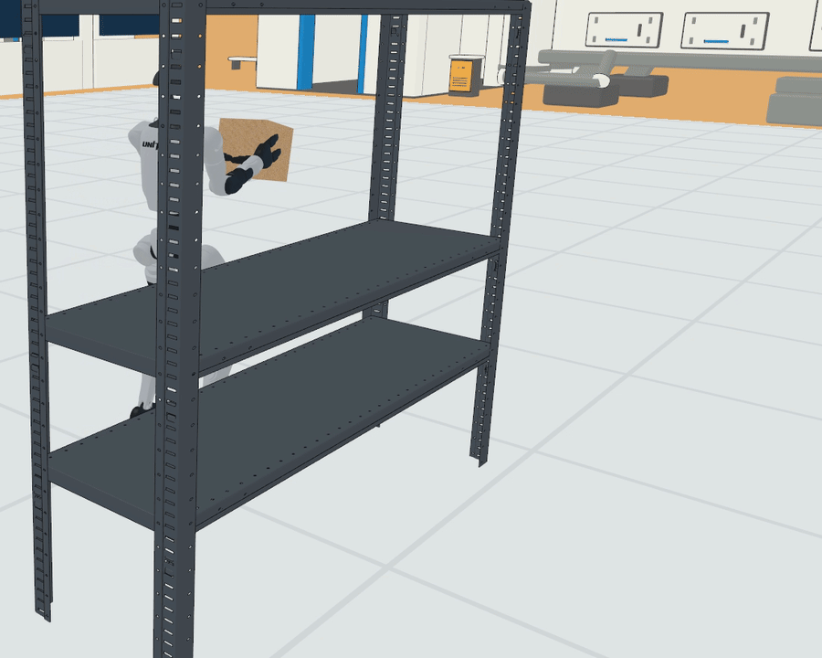
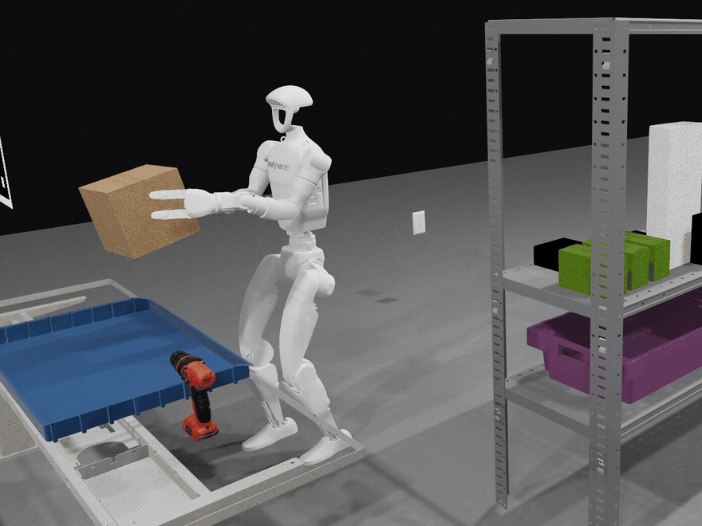

# Sai_Lab

Sai_Lab 汇集三个独立的机器人 Sim2Sim 工程，覆盖 MicroDuck、Unitree G1、轮式变体和 Sai Robot 的仿真、控制与训练。

| 目录 | 工程 | 说明 |
| --- | --- | --- |
| [Bevy_Sim2Sim](Bevy_Sim2Sim/README.md) | MuJoCo → Bevy / Rapier | Rust 工程、单世界 50 Hz 原生物理、科学站、G1 本地视觉任务与 MicroDuck 诊断。完整行为仍在验收。 |
| [Godot_Sim2Sim](Godot_Sim2Sim/README.md) | MuJoCo ↔ Godot/Jolt | MicroDuck、轮滑版和 Sai Robot 的场景、控制与训练。 |
| [Unity_Sim2Sim](Unity_Sim2Sim/README.md) | Unity/团结引擎 + MuJoCo 原生 | MicroDuck 的原生物理运行、ONNX 策略与场景实现。 |

三个工程分别维护依赖、运行命令和验收。克隆后进入对应目录，按各自 README 操作。

## Bevy 当前进展







主页录像均已按 URI 风格重新录制。G1 保留官方银灰外壳和深色关节，科学站使用蓝／黄橙／暖白配色；风格只作用于主窗口，VLA 相机和控制合同保持原样。实现与验证见 [G1 展示渲染](Bevy_Sim2Sim/docs/g1_uri_presentation.md)。

G1 的科学站中文指令 → 本地 Qwen 视觉决策 → 持物行走 → 容器释放已再次完成单轮成功。上方新 12 秒 GIF 取自这次实际运行，完整原片为 98.44 秒，三次 Qwen 与四次原配 N1.6 都在本机执行。原冻结的五组位置 × 两个种子测试成绩仍为 **1/10，未达到 8/10**；一轮录像工具中断也保留在分母中，没有重试或调门槛。新修复距离区间误判后，两例开发回归分别完成完整放置、到达容器后因释放间隙不足暂停，不替换原十轮。上方 GIF 来自新成功回归，见 [距离修复](Bevy_Sim2Sim/docs/g1_milestone.md#精细靠近距离修复与两例原生回归)。原成功样例、失败分类和录像边界见 [十轮运行记录](Bevy_Sim2Sim/docs/g1_milestone.md#科学站-t2-五位置两种子110未达标)。此前科学站持箱行走、苹果取放和源任务场景录像继续保留。**中文交互执行、T1/T2 成功率、恢复／地形和全程连续运行仍待验收**。

- **工程基础**：一个 Rapier 世界，默认 50 Hz、每 Tick 一次积分；G1 与 MicroDuck 保留独立合同；实时开发窗口使用独立工作线程执行物理和 CPU ONNX 推理。
- **科学站与显示**：当前场景为 `windpass_compound_v7`，支持固定机位、跟随相机、静态文字烘焙，以及腿式／轮式机器人的原生位姿显示。
- **性能**：2026-09-30 在 NVIDIA GB10、Linux / Vulkan、1080p 原画质的开发诊断中，FIFO 平均约 60 FPS，不锁帧约 150–157 FPS；新增主线程纯计算预算可先按 10 ms 规划。完整条件和帧节奏限制见 [Bevy 性能进展](Bevy_Sim2Sim/README.md#性能进展)。
- **验收状态**：工程、渲染与诊断链路已合入主干。旧 ONNX 的 60/60 重放仍会失稳；G1 诊断链路按阶段合入；正式成功率、恢复与地形验收仍缺，MicroDuck 完整 BAM、源接触等价、新技能与正式游戏循环继续推进。

[Bevy 运行说明](Bevy_Sim2Sim/README.md#快速开始) · [实施计划](Bevy_Sim2Sim/docs/implementation_plan.md) · [开发交接](Bevy_Sim2Sim/docs/handoff.md) · [CPU CI](https://github.com/sgyli7/Sai_Lab/actions/workflows/bevy_sim2sim_cpu.yml)

## 快速进入工程

```bash
git clone https://github.com/sgyli7/Sai_Lab.git
cd Sai_Lab/Bevy_Sim2Sim
# 也可选择 Sai_Lab/Godot_Sim2Sim 或 Sai_Lab/Unity_Sim2Sim

# Bevy 科学站预览；需要 Rust 1.98 和可用的图形桌面
cargo run --locked --release -- --scene science_station_preview --robot none
```

## 来源与许可

Godot 工程保留原 `Robot_Godot_Sim2Sim` 的提交历史、[LICENSE](Godot_Sim2Sim/LICENSE) 和 [NOTICE](Godot_Sim2Sim/NOTICE)。Unity 工程从 [MicroDuck-Unity-Sim2Sim](https://github.com/sgyli7/MicroDuck-Unity-Sim2Sim) 导入并保留其提交历史；其 [NOTICE](Unity_Sim2Sim/NOTICE) 说明 MicroDuck 3D 模型及衍生网格的非商业许可限制。使用或分发前请分别查看各目录的许可文件。

Bevy 自研 Rust 包在 [Cargo.toml](Bevy_Sim2Sim/Cargo.toml) 中声明 Apache-2.0；Rapier 源码与字体保留各自的第三方许可。MicroDuck 模型仍须遵守上游模型许可，详见 [Bevy 来源与许可](Bevy_Sim2Sim/README.md#来源与许可)。

## 迁移期间的开发

已有任务如果还在旧的 `Robot_Godot_Sim2Sim` 本地检出目录工作，请先把自己的改动提交到独立分支，再同步新的 `main`。不要在有未提交改动时直接切换到迁移后的 `main`；文件路径已经整体移动，Git 可能需要人工处理冲突。新的 Bevy、Godot、Unity 改动分别放在 `Bevy_Sim2Sim/`、`Godot_Sim2Sim/`、`Unity_Sim2Sim/`。原 GitHub 仓库地址会重定向到 `Sai_Lab`，但建议将本地 `origin` 更新为新地址。
